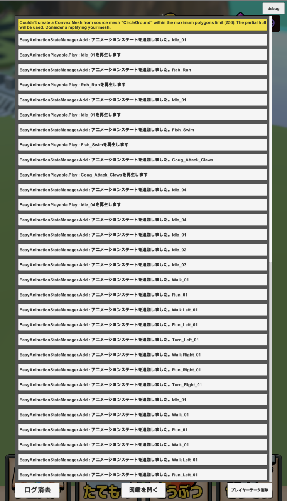

# Framework
A framework for game development in Unity

I am using [Odin --Inspector and Serializer] (https://assetstore.unity.com/packages/tools/utilities/odin-inspector-and-serializer-89041).
(I don't think it's very difficult to replace the user part)

Although it is written as a framework, it is recommended to extend it according to your own project by using it as a skeleton.

If you want to use it as it is, please place it under Unity's Assets.

## table of contents
### Runtime
* **Fast and easy animation system using Playable API**
* **Animation event system**
* **Always active coroutine function**
* **Clean Architecture**
* **Database that can read master data & player data**
* **Debug function compatible with smartphones**
* **Simple Reactive Property**
* **SoundManager**
* **StateMachine**
* **Various utilities**
### Editor
* **Animation event editor that can set various animation events**
* **Automatic code generation based on Clean Architecture**
* **Automatically generate Database code that can read master data & player data**
* **Definition generation for Unity**
* **Various Editor utilities**

## detail of function

### Fast and easy animation system using Playable API

#### **Easy Animation**

An animation system that uses the Playable API.


This is useful for animating 3D characters.

It also supports single animation playback from AnimationClip and blended animation using BlendTree.

**Prerequisites**

You need an animation model and an animation that corresponds to that model.

**how to use**

To the root of a 3D model that meets the conditions
* Animator
* Easy Animation

Attach the script for.

Set Avatar of 3D model to Avatar of Animator.

**Inspector**

| Name | Use |
| ---- | ---- |
| playAutomaticallyOnAwake | Whether to initialize the animation during Awake |
| playAutomaticallyOnInitialize | Do you want to play number 0 when initializing the animation? |
| animationClips | Animation clips to use |
| blendTrees | Blend Trees Used |

#### **Single Animation**
A standalone animation version of Easy Animation.

Effective for background objects that have only one action

**Prerequisites**

You need an animation model and an animation that corresponds to that model.

**how to use**

Same as Easy Animation

**Inspector**

| Name | Use |
| ---- | ---- |
| animationClip | Corresponding animation clip |
| playAutomatically | Whether to play at initialization |

#### **LegacyEasyAnimation**
An animation system that uses Legacy Animation.

It is effective for UI.

You can set a single animation and lend it.

**Prerequisites**

You need an Animation Clip with Legacy checked.

**how to use**

Attach LegacyEasyAnimation and add the corresponding AnimationClip.

**Inspector**

| Name | Use |
| ---- | ---- |
| animation | Corresponding animation clips |

### Animation event system
An animation event system that supports Easy Animation.


There is a dedicated editor system for adding animation events. (See below)

Allows you to switch animation events at runtime.

It is paired with Easy Animation.

It corresponds to the following events.

* Effects
* Sound

**Prerequisites**

I'm using Easy Animation

**how to use**

Attach AnimationEventInvoker to the GameObject with EasyAnimation.

Create AnimationEvents to play. Attach the asset to AnimationEventInvoker.

Use the AnimationEventEditor described later to set an Event for Animation.

**Inspector**

| Name | Use |
| ---- | ---- |
| animationEvents | Corresponding AnimationEvents |
| convertAutomaticallyOnAwake | Convert AnimationEvents during Awake |

### Always active coroutine function

In Unity, coroutines left to inactive GameObjects will stop. So I added a singleton coroutine object that doesn't become inactive.

**how to use**


```
Coroutine _coroutine;
IEnumerator DoExecute ()
{
    // Execute
}
// reproduction
_coroutine = AbsolutelyActiveCoroutine.Subscribe (DoExecute);

// Stop
AbsolutelyActiveCoroutine.Stop (_coroutine);

void Execute ()
{

}

// Playback with specified number of seconds
_coroutine = AbsolutelyActiveCoroutine.WaitSecondInvoke (Execute, 3.0f);

// Seconds specified playback: Stop
AbsolutelyActiveCoroutine.Stop (_coroutine);
```

### Clean Architecture

We support game production based on Clean Architecture.

Search for Clean Architecture for more information.

#### **Context**

It is owned by each scene of the game.

For example, the unit is the title screen, in-game screen, out-game screen, etc.

* Scene transition
* Parameter assignment at the time of scene transition
* Show / hide the corresponding scene UI

#### **UseCase**

It has no data and is specialized for manipulating.

Has a corresponding Presenter.

#### **Presenter**

It is for manipulating the view.

It is possessed by UseCase and acts as a link with View.

#### **View**

This is the appearance part. It has no algorithm. Has a UI, 3D model, etc.

It is held by the Presenter.

#### **Container**

It is used when passing parameters from Context / UseCase to another Context / UseCase.

### Database that can read master data & player data

It is a mechanism that can write and read master data and player data.

You can support various data formats by extending the Data Store yourself.

It follows the Clean Architecture.

#### **Repository**

This is the window to access the data.

It is a singleton object.

#### **Model**

This data is easy to operate on the application side.

#### **Entity**

This data corresponds to the data format to be read.

#### **Primary Key**

Synonymous with general Primary Key.

Extend when retrieving data from Repository.

#### **DataStore**

It is a mechanism to read data.

It is used by extending it according to the supported data formats such as Json, Yaml, and Protocol buffers.

### Debug function compatible with smartphones

This function allows you to display Debug log information on your smartphone.



**how to use**

Set USE_DEBUG_LOG to true in Define settings

```
DebugLog.Normal ("Normal Log");
DebugLog.Warning ("Warning Log");
DebugLog.Error ("Warning Log");
```

Then customize DebugCanvas.prefab to your liking.

### Simple ReactiveProperty

Ability to call back when the value changes. Think of it as a simplified version of UniRx Reactive Property.

```
ReactiveProperty <int> _intProperty = new ReactiveProperty <int> ();

var disposable = _intProperty.Subscribe (Observer.CreateObserver <int> (integer =>
{
    // OnNext Excute
}, exception =>
{
    // Error Excute
}, () =>
{
    // Completed Excute
}));

// int value & callback OnNext
_intProperty.Value = 7

// callback completed
disposable.Dispose ();
```

### SoundManager

A simple sound manager. Singleton object

* Pooling
* Playback by ID
* ID division between SE and BGM

**how to use**

```
SoundManager.I.PlaySE ("SE Name", 0);
SoundManager.I.PlaySE ("SE Name2", 1);
SoundManager.I.PlayBGM ("SE Name2", 0);
```

### StateMachine

It provides a general State Machine.

### Animation event editor that can set various animation events

An editor that makes it easy to set AnimationEvent with GUI.


**how to use**

Display AnimationEventEditor by Framework → AnimationEventEditor

Tap the GameObject to which EasyAnimation / AnimationEventInvoker of Scene is attached.

Add AnimationEvent with Add in AnimationEventEditor.

Apply the corresponding AnimationClip.

An AnimationClip frame will appear, so click on the frame where you want to fire the Event to select it.

Set the Event of the selected frame.

### Automatic code generation based on Clean Architecture

UseCase/Presenter/View are automatically generated.


**how to use**

Add the namespace and class names.
Since there are Use Cases where the view does not exist, the "View exists" flag is also written.


### Automatically generate Database code that can read master data & player data

Repository, Model, Entity, PrimaryKey, DataStore are automatically generated based on the defined json.

Basically, all of the above is automatically generated, but in some cases you may not want to generate it, so we are flagging it.

** Defined JSON sample **

Please create a Json in this state

The author is making json from a spreadsheet with gas.

```
[
 {
  "id": "int",
  "uniqueId": "int",
  "architectureName": "string",
  "architectureUIScale": "float",
  "architectureType": "ArchitectureType",
 }
]
```

### Definition generation for Unity

It is a mechanism to generate Define for the preprocessor.

It will be displayed when you write the definition corresponding to symbols.xml.

