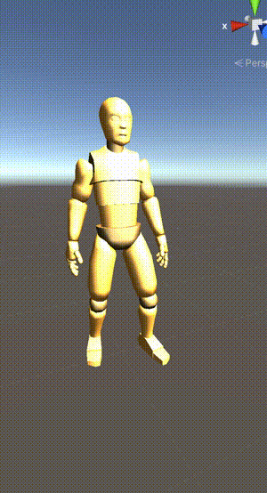
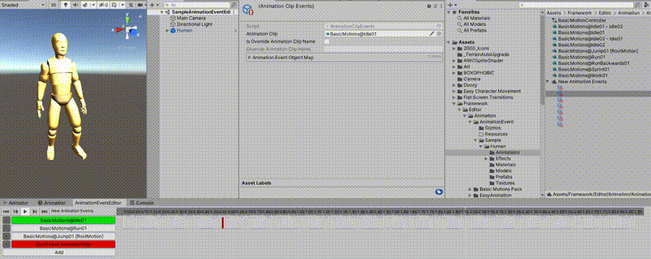
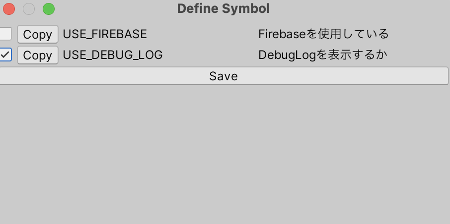

# Framework
Unityでのゲーム開発用フレームワークです

[Odin - Inspector and Serializer](https://assetstore.unity.com/packages/tools/utilities/odin-inspector-and-serializer-89041)を使用しています。
(利用部を置き換えることはさほど難しくないと思います)

フレームワークと書いてますが、スケルトンな使い方で自身のプロジェクトに合わせて拡張していくのがおすすめです。

そのまま使用する場合はUnityのAssets配下に配置してください

## 目次
### Runtime
* **PlayableAPIを使用した高速で簡単なアニメーションシステム**
* **アニメーションイベントシステム**
* **必ずアクティブなコルーチン機能**
* **CleanArchitecture**
* **マスターデータ&プレイヤーデータを読み込みできるDatabase**
* **スマートフォンに対応しているDebug機能**
* **簡易ReactiveProperty**
* **SoundManager**
* **StateMachine**
* **様々なユーティリティ**
### Editor
* **様々なアニメーションイベントを設定できるアニメーションイベントエディター**
* **CleanArchitectureをもとにしたコード自動生成**
* **マスターデータ&プレイヤーデータを読み込みできるDatabaseコード自動生成**
* **Unity用定義生成**
* **様々なEditor用ユーティリティ**

## 機能詳細

### PlayableAPIを使用した高速で簡単なアニメーションシステム

#### **EasyAnimation**

PlayableAPIを利用したアニメーションシステムです。


3Dキャラクターをアニメーションさせる場合に有効です。

AnimationClipからの単体アニメーション再生とBlendTreeを利用したブレンドアニメーションにも対応しています。

**前提条件**

アニメーション用モデルとそのモデルに対応したアニメーションが必要です。

**使用方法**

条件を満たした3DモデルのRootに
* Animator
* EasyAnimation

のスクリプトをアタッチします。

AnimatorのAvatarに3DモデルのAvatarを設定してください。

**Inspector**

|  名前  |  用途  |
| ---- | ---- |
|  playAutomaticallyOnAwake  |  Awake時にアニメーションを初期化するか  |
|  playAutomaticallyOnInitialize  |  アニメーションを初期化時に0番を再生するか  |
|  animationClips  |  使用するアニメーションクリップ  |
|  blendTrees  |  使用ブレンドツリー  |

#### **SingleAnimation**
EasyAnimationの単体アニメーションバージョンです。

1アクションしかしない背景オブジェクトなどに有効です

**前提条件**

アニメーション用モデルとそのモデルに対応したアニメーションが必要です。

**使用方法**

EasyAnimationと同じです

**Inspector**

|  名前  |  用途  |
| ---- | ---- |
|  animationClip  |  対応したアニメーションクリップ  |
|  playAutomatically  |  初期化時に再生するかどうか  |

#### **LegacyEasyAnimation**
LegacyAnimationを利用したアニメーションシステムです。

UIとかに有効です。

単体のアニメーションを設定して動貸すことができます。

**前提条件**

Legacyにチェックの入ったAnimationClipが必要です。

**使用方法**

LegacyEasyAnimationをアタッチして、対応したAnimationClipを追加します。

**Inspector**

|  名前  |  用途  |
| ---- | ---- |
|  animation  |  対応したアニメーションクリップ  |

### アニメーションイベントシステム
EasyAnimationに対応したアニメーションイベントシステムです。



アニメーションイベントを追加するための専用のエディターシステムがあります。（後述）

ランタイムでアニメーションイベントを切り替えれるようにしています。

EasyAnimationと一対になっています。

以下のイベントに対応しています。

* エフェクト
* サウンド

**前提条件**

EasyAnimationを使用している

**使用方法**

EasyAnimationがついているGameObjectにAnimationEventInvokerをアタッチします。

再生するAnimationEventsを作成します。そのアセットをAnimationEventInvokerにアタッチする。

後述するAnimationEventEditorを使用して、Animationに対してEventを設定していきます。

**Inspector**

|  名前  |  用途  |
| ---- | ---- |
|  animationEvents  |  対応したAnimationEvents  |
|  convertAutomaticallyOnAwake  |  Awake時にAnimationEventsをコンバートする  |

### 必ずアクティブなコルーチン機能

Unityでは非アクティブなGameObjectに任せたコルーチンは止まってしまいます。なので非アクティブにならないシングルトンなコルーチンオブジェクトを追加しました。

**使用方法**


```
Coroutine _coroutine;
IEnumerator DoExecute()
{
    // Execute
}
// 再生
_coroutine = AbsolutelyActiveCoroutine.Subscribe(DoExecute);

// 停止
AbsolutelyActiveCoroutine.Stop(_coroutine);

void Execute()
{

}

// 秒数指定再生
_coroutine = AbsolutelyActiveCoroutine.WaitSecondInvoke(Execute, 3.0f);

// 秒数指定再生:停止
AbsolutelyActiveCoroutine.Stop(_coroutine);
```

### CleanArchitecture

CleanArchitectureをもとにしたゲーム制作支援を行います。

詳しくはCleanArchitectureで検索してください。

#### **Context**

ゲームのシーン単位で持つものです。

例えば、タイトル画面・インゲーム画面・アウトゲーム画面など単位です。

* シーン遷移
* シーン遷移時のパラメータ付与
* 対応したシーンUIの表示・非表示

#### **UseCase**

データをもたず、操作することに特化したものです。

対応するPresenterを持ちます。

#### **Presenter**

見た目(view)を操作するためのものです。

UseCaseに持たれており、Viewとのつなぎ役を行います。

#### **View**

見た目部分です。一切のアルゴリズムを持たず。UI・3Dモデルなどを持ちます

Presenterに持たれます。

#### **Container**

Context・UseCaseなどから別のContext・UseCaseにパラメータを渡すときに使用します。

### マスターデータ&プレイヤーデータを読み込みできるDatabase

マスターデータとプレイヤーデータを書き込み・読込できる仕組みです。

自分でDataStoreを拡張することで様々なデータ形式に対応できます。

CleanArchitectureに則っています。

#### **Repository**

データにアクセスする窓口です。

シングルトンなオブジェクトです。

#### **Model**

アプリケーション側で操作しやすいようにしたデータです。

#### **Entity**

読み込みするデータ形式に対応したデータです。

#### **PrimaryKey**

一般的なPrimaryKeyと同義です。

Repositoryからデータを検索したりする場合に拡張します。

#### **DataStore**

データを読み込む機構です。

JsonやYaml、Protocolbuffersなど対応したデータ形式に沿った拡張をして使用します。


### スマートフォンに対応しているDebug機能

Debugログ情報をスマートフォンでも表示できる機能です。


**使用方法**

Define設定でUSE_DEBUG_LOGをtrueにする

```
DebugLog.Normal("Normal Log");
DebugLog.Warning("Warning Log");
DebugLog.Error("Warning Log");
```

あとはDebugCanvas.prefabを自分の好きなようにカスタマイズしてください。

### 簡易ReactiveProperty

値が変わったときにコールバックをする機能。UniRxのReactiveProperty簡易版だと思ってください。

```
ReactiveProperty<int> _intProperty = new ReactiveProperty<int>();

var disposable = _intProperty.Subscribe(Observer.CreateObserver<int>(integer =>
{
    // OnNext Excute
}, exception =>
{
    // Error Excute
}, () =>
{
    // Completed Excute
}));

// int value & callback OnNext
_intProperty.Value = 7

// callback completed
disposable.Dispose();
```

### SoundManager

シンプルなサウンドマネージャー。シングルトンオブジェクト

* プーリング
* ID単位での再生
* SEとBGMでのIDわけ

**使用方法**

```
SoundManager.I.PlaySE("SE Name", 0);
SoundManager.I.PlaySE("SE Name2", 1);
SoundManager.I.PlayBGM("SE Name2", 0);
```

### StateMachine

一般的なStateMachineを提供してます。

### 様々なアニメーションイベントを設定できるアニメーションイベントエディター

AnimationEventをGUIで設定しやすいようにしているエディターです。



**使用方法**

Framework→AnimationEventEditorでAnimationEventEditorを表示

SceneのEasyAnimation・AnimationEventInvokerがアタッチされているGameObjectをタップします。

AnimationEventEditorのAddでAnimationEventを追加します。

対応するAnimationClipをApplyします。

AnimationClipのフレームが出るので、Eventを発火させたいフレームをクリックして選択する。

選択したフレームのEventを設定する。

### CleanArchitectureをもとにしたコード自動生成

UseCase・Presenter・Viewを自動生成します。


**使用方法**

namespaceとclassの名前を追加します。
viewが存在しないUseCaseもあるので「Viewが存在する」フラグも書いてます。


### マスターデータ&プレイヤーデータを読み込みできるDatabaseコード自動生成

定義されたjsonをもとにRepository・Model・Entity・PrimaryKey・DataStoreを自動生成します。

基本的には上記をすべて自動生成しますが、場合によっては生成したくないことがあると思うので、フラグわけをしています

**定義されたJSONのサンプル**

こちらの状態のJsonを作成してください

作成者はgasでスプレッドシートからjsonを作っています。

```
[
 {
  "id": "int",
  "uniqueId": "int",
  "architectureName": "string",
  "architectureUIScale": "float",
  "architectureType": "ArchitectureType",
 }
]
```

### Unity用定義生成

プリプロセッサ用のDefineを生成する仕組みです。

symbols.xmlに対応する定義を書き込むと表示されるようになります。

